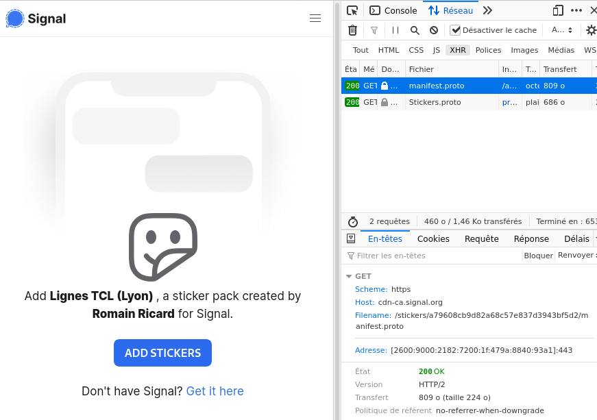

# Signal stickers internals

## What is a sticker pack, actually?

A _pack of stickers_ contains:
+ A **manifest**: this file contains the metadata of the pack:
    + The **title**;
    + The **author** name;
    + The **list of stickers**, with their **emoji mapping**;
    + The **cover**: the `id` of the sticker used as the cover for the pack. 
+ **Stickers**: the actual image data.


The manifest is serialized using ProtocolBuffers (see the [Python
adapter](signalstickers_client/classes/Stickers_pb2.py) and Signal's [proto
file](https://signal.art/addstickers/Stickers.proto))

## Uploading a pack

_Prerequisites: files are ready to be sent to the server, and a protobuffed manifest_

1. A request is sent to a Signal service
   (`textsecure-service.whispersystems.org`) to register the pack. You need to
   be authenticated with your Signal credentials. Basically, it goes like
   > \- "Hey, I'm [USER] and I'd like to upload _n_ stickers"  
   > \- "Hey, no problem, here are your credentials for uploading content"
   
   This will return some credentials, that we will use in the next steps. It
   will also return a `pack ID`, generated by Signal.

2. You will need to encrypt locally the stickers and the manifest: generate a 64
   chars-long `pack key`, and encrypt each element with AES CBC, with `PKCS#7`
   padding. You will find all crypto-related code [here](signalstickers_client/classes/signalcrypto.py).

3. Send the encrypted manifest to Signal's CDN (`cdn.signal.org`), using the
   credentials from step 1.

4. Upload all encrypted stickers to Signal's CDN (`cdn.signal.org`), using the
   credentials from step 1.


Now you have it: a `pack id`, generated by Signal, a `pack key`, generated by
you, and all the encrypted data on Signal's CDN.

Signal say that the packs are not linked to your account. This is hard to
verify, as you need your Signal credentials to upload a pack. In any case,
Signal can't have access to your stickers (until you share them), but they
_could_ link a pack to you. 

## Downloading a pack

The `signal.art` URL structure is as follow:

```
https://signal.art/addstickers/#pack_id=1337...&pack_key=cafebeef42...
```

+ `https://signal.art/addstickers/` : the URL of the server, nothing new
+ `#` this is important: it means that the rest will not be sent to the server
+ `pack_id={32 chars}` : the identifier of the pack (`pack id`)
+ `pack_key={64 chars}` : the key (`pack key`)


On the `signal.art` page, a call is done to Signal's CDN to fetch the manifest,
which is then decrypted in the browser to display the name of the pack and its
author.



When opening a sticker pack in the app:

1. Manifest is fetched by the app at `cdn.signal.org/stickers/{pack
   id}/manifest.proto`, then decrypted using the `pack key`
2. Individuals stickers files are fetched at `cdn.signal.org/stickers/{pack
   id}/full/{sticker id (int))}` then decrypted using the `pack key`

_The same principle is applicable for downloading pack when receiving a sticker._
